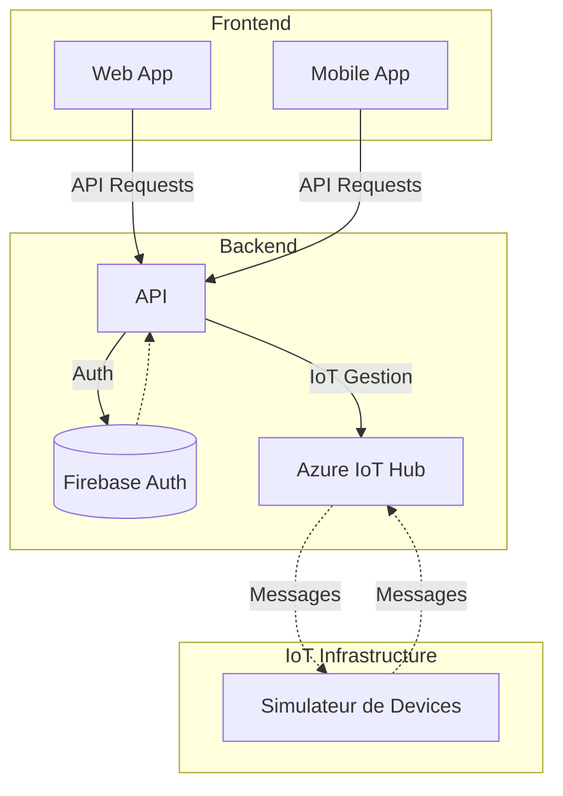

# Hackaton

projet réalisr dans le cadre d'un hackaton

# instalation

```
npm install
```

```
npx expo start
```

# architecture



# problèmes rencontrés

## application mobile

nous avons rencontré beaucoup de problèmes pour les commandes vocales sans trouver de résultats comcluants que ce soit en reeact native ou en flutter. 
nous avons fait le choix de faire l'application en react native pour avoir un architecture uniquement en JS.